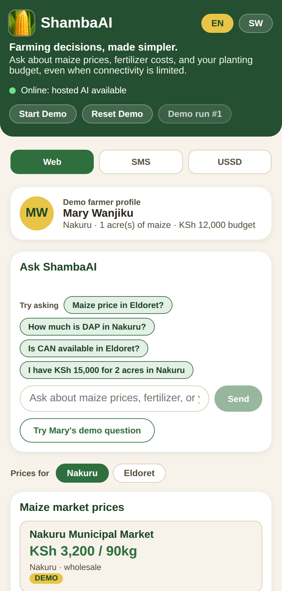
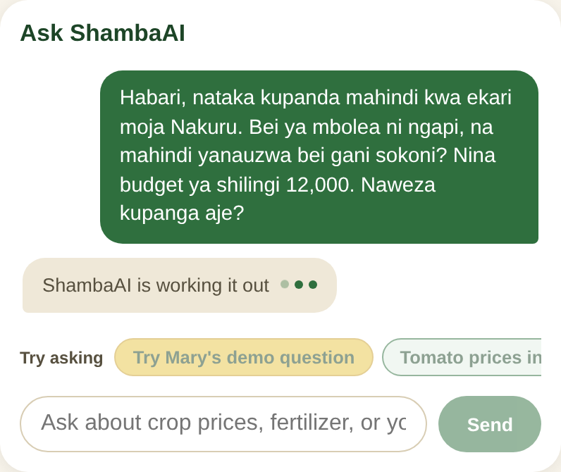
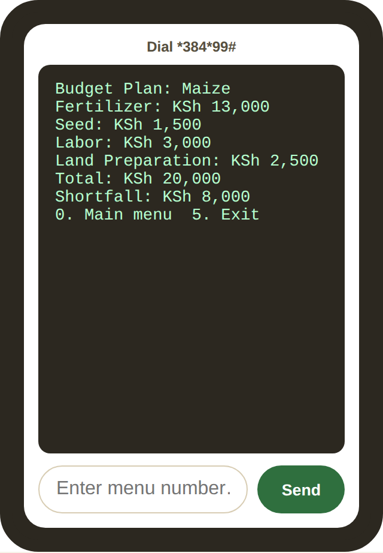

# ShambaAI

**Farming decisions, made simpler.**

ShambaAI is an offline-first AI agent that helps Kenyan smallholder farmers check crop
prices, compare fertilizer costs, and plan a planting budget. One agent serves three
channels, so the same answers reach a farmer on a smartphone, a basic phone that can
send SMS, or a feature phone that can only dial a USSD menu. It keeps working when the
internet connection is poor or gone.

<p align="center">
  
</p>

<p align="center"><em>On a phone: dashboard, chat, and the USSD budget menu</em></p>

<p align="center">
  
  
  
</p>

> **All prices, suppliers and stock levels in this project are demo data.** They are
> illustrative, clearly labeled as such everywhere they appear, and are not live market
> quotes. The SMS and USSD screens are simulators, not a real telecom connection.

## Contents

- [The problem](#the-problem)
- [The demo farmer](#the-demo-farmer)
- [Quick start](#quick-start)
- [Running the demo](#running-the-demo)
- [Features](#features)
- [How it works](#how-it-works)
- [Technologies used](#technologies-used)
- [AI providers](#ai-providers)
- [Working offline](#working-offline)
- [Testing](#testing)
- [API reference](#api-reference)
- [Project structure](#project-structure)
- [Deploying](#deploying)
- [Troubleshooting](#troubleshooting)
- [Limitations](#limitations)

## The problem

Most AI tools assume a modern smartphone, reliable internet and a data bundle. Many
smallholder farmers in Kenya have none of those consistently, yet they still need to
know what their crop is selling for, what fertilizer costs, and whether their budget covers
the season.

ShambaAI adapts to the farmer's technology instead of asking the farmer to adapt. The
same agent answers through a web app, SMS and USSD, and the core features keep working
without a connection.

## The demo farmer

The demo is built around one fictional farmer:

| | |
|---|---|
| **Name** | Mary Wanjiku |
| **Location** | Nakuru County |
| **Farm** | 1 acre of maize |
| **Budget** | KSh 12,000 |

Mary asks a mixed Kiswahili and English question, the way many farmers actually write:

> Habari, nataka kupanda mahindi kwa ekari moja Nakuru. Bei ya mbolea ni ngapi, na
> mahindi yanauzwa bei gani sokoni? Nina budget ya shilingi 12,000. Naweza kupanga aje?

*(Hello, I want to plant maize on one acre in Nakuru. How much is fertilizer, and what
does maize sell for at the market? I have a budget of 12,000 shillings. How can I plan?)*

ShambaAI recognises the language, picks out the county, farm size and budget, looks up
maize and fertilizer prices, calculates the budget, and replies in Kiswahili. For Mary
the plan comes to KSh 20,000 with DAP fertilizer, so it tells her she is KSh 8,000
short.

## Quick start

**Requirements:** Node.js 22 or newer, and npm.

```bash
npm install
```

Start the backend and the frontend in two terminals:

```bash
npm run dev:server    # API on http://localhost:4000
npm run dev:client    # Web app on http://localhost:5173
```

Open **http://localhost:5173**. That's all you need: no API keys, no database server
and no internet connection. Without an AI provider configured, ShambaAI answers from
its built-in templates, which contain the same numbers.

To turn on AI-written replies, copy the example settings file and fill it in (see
[AI providers](#ai-providers)):

```bash
cp server/.env.example server/.env
```

## Running the demo

The full demo takes about 90 seconds.

| Time | Step |
|---|---|
| 0 to 15s | Explain the problem: AI tools assume a smartphone and good internet. |
| 15 to 35s | Click **Start Demo**. Mary's question is sent and the reply shows maize prices, fertilizer prices and her budget plan. |
| 35 to 50s | Open the **SMS** tab and send `Bei ya mbolea Nakuru?`. The same agent answers in a short text message. |
| 50 to 65s | Open the **USSD** tab. Choose `3` (Plan budget), `1` (Maize), `1` (Nakuru), `1` (acre), `12000`, `1` (DAP) to get the same budget on a feature phone menu. |
| 65 to 80s | Turn off the network and reload. The status changes to *Offline: cached data available* and prices, chat and the budget calculator keep working. |
| 80 to 90s | Wrap up: one agent, three channels, adapting to the farmer's device and connection. |

**Reset Demo** clears the chat, SMS history and budget form and reloads the demo data,
ready for the next run.

**For the offline step, use the production build.** The part that lets the page reload
with no connection (the service worker) only runs in the production build:

```bash
npm run preview:client   # builds, then serves on http://localhost:4173
```

Keep `npm run dev:server` running, open http://localhost:4173 once while online so the
app can save itself, then turn off the network and reload.

## Features

### Three channels, one agent

- **Web app.** A mobile-first dashboard with chat, crop price cards, fertilizer
  comparison cards, a budget calculator, a connection status indicator and an
  English/Kiswahili switch.
- **SMS simulator.** A phone-style messaging screen. Replies are kept to 320
  characters and always start with the demo-data label, so a long reply can never cut
  it off.
- **USSD simulator.** A feature-phone menu with numbered options, back (`0`), exit
  (`5`), input checks, and English/Kiswahili menus.

All three call the same agent and the same price and budget services. There is no
separate logic per channel apart from the USSD menu steps and the SMS length limit.

### Key points at a glance

- Every chat answer opens with highlighted key points: the highest crop price, the
  cheapest fertilizer that is actually in stock, the estimated cost, and whether the
  budget is short (red) or has money left (green). These come from the calculated
  data, never from the AI's wording, so they are always the correct figures.
- Prices inside replies are highlighted so they stand out from the text.
- Price cards flag the **Best price** for the crop and the **Cheapest in stock**
  fertilizer. Out-of-stock fertilizer is dimmed and never recommended.

### Interactive

- A row of tap-to-ask suggestions above the message box, in English or Kiswahili,
  starting with Mary's demo question. Swipe it sideways to see more.
- A "working it out" indicator while an answer is on its way.
- **Crop** and **County** pickers above the price cards. Asking about a crop or county
  in chat switches the cards and the budget calculator to match.
- The budget calculator updates as you type, with a large *Short by* or *Left over*
  figure, a bar showing how much of the cost the budget covers, and the biggest cost
  highlighted.

### Phone and desktop

- **Phones and tablets** get a single column: chat (or the SMS or USSD phone), then the
  prices, then the budget calculator. On the SMS and USSD tabs a phone shows only the
  simulator, to keep it uncluttered.
- **Laptops and desktops** (1024 pixels wide and up) get two columns: the chat or
  phone simulator on the left and the prices on the right, ending at the same line,
  with the budget calculator in a full-width row underneath. The whole page scrolls
  together, and a long conversation scrolls inside the chat box.

### Language

- The page opens in English. The **EN / SW** switch changes the page language.
- Replies follow the language of the question, not the page. A Kiswahili question gets
  a Kiswahili answer and an English question gets an English one.
- Kiswahili number words are understood, so *ekari moja* is read as 1 acre.

### Crops and counties

Six crops that are common or high-value for Kenyan smallholders, each sold in the unit
farmers actually use:

| Crop | Kiswahili | Sold by | Demo counties |
|---|---|---|---|
| Maize | Mahindi | 90kg bag | Nakuru, Eldoret, Kericho |
| Beans | Maharagwe | 90kg bag | Nakuru, Eldoret, Kericho |
| Irish potatoes | Viazi | 50kg bag | Nakuru, Eldoret |
| Tomatoes | Nyanya | 64kg crate | Nakuru, Eldoret, Kericho |
| Tea | Majani chai | kg of green leaf | Kericho |
| Sukuma wiki (kale) | Sukuma wiki | kg | Nakuru, Eldoret, Kericho |

- Pick a crop and county above the price cards, or just ask in chat, SMS or USSD. The
  chat understands the English and Kiswahili names, plus common local words such as
  *waru* for potatoes and *Molo* for the Nakuru potato area.
- Tea only has prices in Kericho, where it is grown, rather than invented prices for
  counties with no tea. Picking a crop and county with no data says so plainly.
- DAP, NPK, Urea and CAN prices come from fictional suppliers in each county, with
  stock status (in stock, low stock, out of stock).
- Every price shows its source, a timestamp, and a demo-data label.

### Budget calculator

The budget is worked out by plain arithmetic, never by the AI. The AI only explains the
result. Each crop has its own defaults, and every assumption can be changed or switched
off under **Assumptions** in the calculator:

| Crop | Usual fertilizer | Bags per acre | Seed per acre | Labour per acre | Land prep per acre |
|---|---|---|---|---|---|
| Maize | DAP | 2 | KSh 1,500 | KSh 3,000 | KSh 2,500 |
| Beans | DAP | 1 | KSh 4,000 | KSh 3,000 | KSh 2,500 |
| Irish potatoes | DAP | 4 | KSh 30,000 (seed potatoes) | KSh 8,000 | KSh 4,000 |
| Tomatoes | DAP | 3 | KSh 6,000 | KSh 12,000 | KSh 4,000 |
| Tea | NPK | 4 | none | KSh 15,000 | none |
| Sukuma wiki | DAP | 2 | KSh 1,000 | KSh 4,000 | KSh 2,500 |

Two crops carry a note on screen. Tea is budgeted as one season's upkeep of bushes
that are already planted, so it has no seed or land preparation cost. The tomato
budget leaves out spraying and staking.

All of these figures are illustrations, not agronomic advice. The app tells farmers to
confirm real rates with a soil test or a local extension officer.

## How it works

```
   Web app          SMS simulator        USSD simulator
      \                   |                    /
       \                  |                   /
        +------------ Express API ------------+
                          |
                    Agent (shared)
         1. detect language and intent
         2. extract crop, county, acres, budget, fertilizer
         3. look up prices           ---> SQLite demo data
         4. calculate the budget     ---> plain arithmetic
         5. build a template reply   (always correct)
         6. ask an AI to reword it   (optional, checked)
```

Step 6 is optional. If an AI provider is configured, it is asked to reword the template
reply in a friendlier way without changing any facts. If the AI changes or drops a
number, answers too slowly, or isn't available, the template reply is sent instead. The
farmer always gets correct numbers.

The database is SQLite, stored in a single file at `server/data/shambaai.db` and
created and filled with the demo data automatically on first start. No database server
or cloud database is needed. Set `SHAMBAAI_DB_PATH` to put the file somewhere else. If
the server can't write to its folder, as on Vercel, it uses the system's temporary
folder instead.

## Technologies used

| Area | Technology | What it does here |
|---|---|---|
| Language | [TypeScript](https://www.typescriptlang.org/) 5.9 | Used for all code, frontend and backend |
| Runtime | [Node.js](https://nodejs.org/) 22 | Runs the backend. Version 22 or newer is required for its built-in SQLite |
| Backend | [Express](https://expressjs.com/) 4 | The API that the web app and all three channels call |
| | [cors](https://www.npmjs.com/package/cors), [dotenv](https://www.npmjs.com/package/dotenv) | Cross-origin requests, and loading settings from `server/.env` |
| Database | SQLite through Node's built-in [`node:sqlite`](https://nodejs.org/api/sqlite.html) | Stores the demo prices, fertilizer listings and the offline request queue in one file, with nothing to install |
| Frontend | [React](https://react.dev/) 18 | The dashboard, chat, price cards, budget calculator and phone simulators |
| | [Vite](https://vitejs.dev/) 5 with [@vitejs/plugin-react](https://www.npmjs.com/package/@vitejs/plugin-react) 4 | Dev server and production build. In development it also forwards `/api` calls to the backend |
| Styling | Plain CSS | No UI framework. Colours are CSS variables, with mobile-first responsive layouts |
| Offline | [vite-plugin-pwa](https://vite-pwa-org.netlify.app/) 0.20 with [Workbox](https://developer.chrome.com/docs/workbox) 7 | Service worker that saves the app so it reloads without a connection, plus the install-to-home-screen manifest |
| | Browser `localStorage` | Last-seen prices with their timestamps, and messages waiting to be sent when the connection returns |
| AI | [Anthropic Messages API](https://docs.anthropic.com/en/api/messages) or any OpenAI-compatible API, such as [NVIDIA NIM](https://build.nvidia.com/) | Optional hosted model that rewords replies |
| | [Ollama](https://ollama.com/) | Optional local model that works without internet |
| | Built-in templates | Always-available replies, used whenever no AI is configured or an AI reply fails the price check |
| Testing | [Vitest](https://vitest.dev/) 2, [Supertest](https://www.npmjs.com/package/supertest) 7, [jsdom](https://github.com/jsdom/jsdom) 25 | Unit and API tests. Supertest calls the Express routes, and jsdom stands in for the browser in frontend tests |
| Dev tooling | [tsx](https://tsx.is/) 4, npm workspaces | Runs the TypeScript server with auto-reload. One `npm install` sets up both the `server` and `client` packages |
| Hosting | [Vercel](https://vercel.com/) (config included) or any Node.js host | See [Deploying](#deploying) |

The chat understands **English and Kiswahili** using keyword and pattern rules written
for this project, so it needs no AI model to work out what a farmer is asking.

## AI providers

ShambaAI tries these in order and uses the first one that works:

1. **Hosted model**, if `HOSTED_AI_API_KEY` is set. Works with Anthropic-style and
   OpenAI-style APIs, including NVIDIA NIM.
2. **Ollama**, a local model, if it is running at `OLLAMA_HOST`.
3. **Templates**, which are always available and need nothing.

Settings go in `server/.env`. The main ones:

| Variable | Default | Purpose |
|---|---|---|
| `PORT` | `4000` | API port |
| `SHAMBAAI_DB_PATH` | `server/data/shambaai.db` | Where the SQLite file is kept |
| `HOSTED_AI_API_KEY` | *(empty)* | Turns on the hosted model |
| `API_STYLE` | `anthropic` | `anthropic` or `openai` request format |
| `HOSTED_AI_BASE_URL` | depends on style | API endpoint |
| `HOSTED_AI_MODEL` | depends on style | Model name |
| `OLLAMA_HOST` | `http://localhost:11434` | Local Ollama address |
| `OLLAMA_MODEL` | `llama3.2` | Local model name |
| `AI_REPLY_BUDGET_MS` | `10000` | Longest the server waits for AI wording before sending the template reply |

See [server/.env.example](server/.env.example) for the full list and notes on which
models were tested.

**Keep `AI_REPLY_BUDGET_MS` below 15000.** The web page waits up to 15 seconds for a
reply. If the server waits longer than that for the AI, the page gives up and shows an
offline answer even though the server is running. With the default of 10 seconds, long
questions like Mary's usually get the template reply, and short questions usually get
the AI-worded one.

API keys stay on the server and are never sent to the browser. `server/.env` is listed
in `.gitignore` so it is never committed.

## Working offline

| Situation | What the farmer sees |
|---|---|
| Server reachable, AI available | AI-worded reply with checked numbers |
| Server reachable, no AI | Template reply, fully working |
| No connection, app used before | Last saved prices, labeled *saved on this device* with the time they were saved |
| No connection, first visit | Sample data built into the app, labeled as such |
| Message sent with no connection | Answered on the device straight away, then sent to the server automatically when the connection returns |

The status bar at the top always shows the real state:

- *Online: hosted AI available*
- *Offline: local AI active*
- *Offline: deterministic fallback*
- *Offline: cached data available*
- *Waiting for connectivity*

ShambaAI never shows saved or sample prices as live, and never claims an AI model is
running when it isn't.

## Testing

```bash
npm test               # everything
npm run test:server    # 85 backend tests
npm run test:client    # 24 frontend tests
```

The tests cover:

- Language and intent detection in English and Kiswahili, including Mary's full question
- Price lookups for all six crops, their selling units, and fertilizer listings, with demo-data labels and timestamps
- Each crop's budget defaults, including tea having no planting cost
- Telling the word "can" apart from CAN fertilizer
- The on-device copy of the data matching the server's exactly
- Budget calculation, shortfalls, editable assumptions and invalid input
- The highlighted key points, including never recommending out-of-stock fertilizer
- API input checks
- USSD menu navigation, going back and exiting
- SMS history and the demo label surviving the length limit
- Falling back to templates when the AI is unavailable, too slow, or changes a price
- The offline message queue and syncing when the connection returns
- The on-device budget calculator and offline chat replies

To check builds:

```bash
npm run build:server
npm run build:client
```

## API reference

The backend runs on port 4000. All routes start with `/api`.

| Method | Route | Purpose |
|---|---|---|
| GET | `/api/status` | Which AI providers are available |
| GET | `/api/crops` | The six crops with their budget defaults |
| GET | `/api/markets?crop=&county=` | Crop prices (`crop` is maize, beans, potatoes, tomatoes, tea or kale) |
| GET | `/api/fertilizer?type=&county=` | Fertilizer listings (`type` is DAP, NPK, UREA or CAN) |
| POST | `/api/budget` | Budget calculation (`crop` defaults to maize) |
| POST | `/api/chat` | Ask a question (web channel) |
| POST | `/api/sms` | Send an SMS: `{ "sessionId", "text" }` |
| GET | `/api/sms/:sessionId/history` | SMS conversation |
| POST | `/api/ussd/start` | Start a USSD session: `{ "sessionId", "locale" }` |
| POST | `/api/ussd/:sessionId/input` | Send a menu choice: `{ "input" }` |
| GET | `/api/demo/profile` | Mary's demo profile |
| POST | `/api/demo/reset` | Reset demo data |
| GET | `/api/queue/pending` | Queued offline requests |
| POST | `/api/queue/process` | Process queued requests |
| GET | `/health` | Health check |

Example:

```bash
curl -X POST http://localhost:4000/api/budget \
  -H "Content-Type: application/json" \
  -d '{"crop":"beans","county":"Nakuru","farmSizeAcres":1,"budgetKsh":20000,"fertilizerType":"DAP"}'
```

## Project structure

```
server/src/
  agent/          language and intent detection, template replies
  agriculture/    crop prices, fertilizer listings, budget calculator
  api/            Express app and routes
  channels/       web, SMS and USSD adapters over the shared agent
  data/           demo dataset
  database/       SQLite setup, seeding and reset
  offline/        server-side queue for requests sent while offline
  providers/      hosted AI, Ollama and template providers
  shared/         crop catalogue, shared types, price formatting, English/Kiswahili text

client/src/
  api/            calls to the backend, with offline fallback
  components/     dashboard, chat, cards, calculator, SMS and USSD simulators
  context/        language, channel and connection state
  offline/        saved data, message queue, and on-device fallback logic
  styles/         theme and layout
```

The web app imports the server's crop catalogue, demo dataset, budget maths and
question-reading code directly (from `server/src/shared`, `server/src/data`,
`server/src/agriculture/budgetMath.ts` and `server/src/agent`), rather than keeping its
own copies. That way the offline answers always match the online ones. None of those
files touch the database, so no server-only code ends up in the browser.

## Deploying

### On a normal server (most reliable for a live demo)

Any host that runs a long-lived Node.js 22 process works, such as a VPS, Render,
Railway, or Fly.io:

```bash
npm install
npm run build:server && npm run build:client
npm run --workspace server start      # API on PORT (default 4000)
```

Serve `client/dist` as static files, and send `/api` requests to the Node process
(for example with nginx, or your host's routing rules). Keep `server/data/` on
storage that survives restarts if you want the database file to persist.

### On Vercel

The repository is set up for Vercel with `vercel.json` and an `api/` entry point:

- The build runs `npm run build:server && npm run build:client`.
- The web app is served from `client/dist`.
- The whole API runs as one serverless function, `api/[[...path]].ts`, which wraps
  the same Express app.

In the Vercel project settings, set the Node.js version to 22 or newer, since the
database needs Node's built-in SQLite. Add your settings, such as `HOSTED_AI_API_KEY`,
under **Environment Variables**. Never commit `server/.env`. After deploying, open
`/health` and `/api/status` on your Vercel address to confirm the API is running.

Things to know about Vercel:

- **The database is temporary.** Vercel only allows writing to a temporary folder, so
  the SQLite file lives there and is rebuilt from the demo data whenever Vercel starts
  a fresh copy of the function. The demo data is the same every time, so prices always
  show, but anything saved, such as the offline request queue, can be lost.
- **SMS history and USSD sessions can reset.** They are kept in memory, and Vercel can
  send one person's requests to different copies of the function. A USSD menu can
  occasionally jump back to the start.
- **For a live presentation**, running on a normal server, or locally, avoids both
  issues.

## Troubleshooting

**`ExperimentalWarning: SQLite is an experimental feature`**
Harmless. ShambaAI uses the SQLite support built into Node 22, which still prints this
warning.

**Why not `better-sqlite3`?**
It has to be compiled during install, and that fails when the project folder path
contains a space (such as `offline agent`). Node's built-in SQLite needs no compiling.

**`EADDRINUSE: address already in use :::4000`**
Another server is already on that port. Stop it with:

```bash
lsof -ti:4000 -sTCP:LISTEN | xargs -r kill
```

**Replies say I'm offline but the server is running**
The server is probably waiting too long for the AI. Make sure `AI_REPLY_BUDGET_MS` in
`server/.env` is below 15000.

**The page doesn't load when offline**
Use `npm run preview:client`, not `npm run dev:client`, and open the page once while
online first.

## Limitations

ShambaAI is a hackathon prototype, not a production service.

- **Demo data only.** No live market, government or supplier data is connected. The
  data layer is separated so a verified source can be added later.
- **No real SMS or USSD.** The simulators are not connected to a telecom provider or
  gateway.
- **No login or rate limiting.** Add both before putting it on the public internet,
  especially if a paid AI key is configured.
- **Open CORS.** The API accepts requests from any website.
- **One server's memory.** SQLite is one file on one machine, and SMS history and USSD
  sessions are kept in the server's memory. That is fine on a single long-running
  server, but on Vercel they can reset between requests (see [Deploying](#deploying)).
- **First visit needs a connection.** A browser that has never opened the app online
  has nothing saved to show offline.
