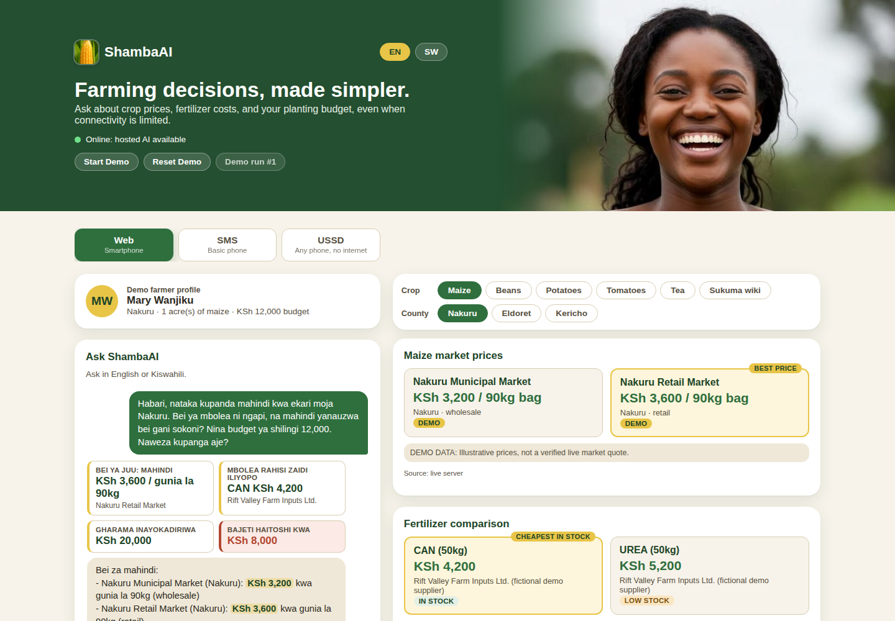

# ShambaAI

**Farming decisions, made simpler.**

An AI assistant that helps Kenyan farmers check crop prices, compare fertilizer costs
and plan their planting budget, even without internet.

<p align="center">
  
</p>

## The problem

Most AI tools need a smartphone and good internet. Many smallholder farmers have
neither.

## Our solution

One assistant that works on **any phone** and **without internet**.

| Channel | Who it is for |
|---|---|
| Web app | Farmers with a smartphone or computer |
| SMS | Farmers with a basic phone |
| USSD menu | Farmers with a feature phone, no internet needed |

## Key features

- **6 crops:** maize, beans, potatoes, tomatoes, tea, sukuma wiki
- **3 counties:** Nakuru, Eldoret, Kericho
- **Fertilizer prices:** DAP, NPK, Urea and CAN, with the cheapest in stock highlighted
- **Budget planner:** shows the total cost and whether the farmer's budget is enough
- **English and Kiswahili:** replies in the farmer's language
- **Works offline:** prices and budgets still work with no connection
- **Always accurate:** numbers come from calculations, never guessed by the AI

## Demo

**Mary** farms 1 acre of maize in Nakuru with KSh 12,000. She asks in Kiswahili:

> *"Bei ya mbolea ni ngapi, na mahindi yanauzwa bei gani sokoni? Nina budget ya
> shilingi 12,000."*
> (How much is fertilizer, what does maize sell for, and I have KSh 12,000.)

ShambaAI replies with maize and fertilizer prices, and tells her the plan costs
**KSh 20,000**, so she is **KSh 8,000 short**.

**Try it:** click **Start Demo**, then open the **SMS** and **USSD** tabs to see the same
answer on a basic phone.

## Run it

Requires Node.js 22 or newer.

```bash
npm install
npm run dev:server    # terminal 1
npm run dev:client    # terminal 2
```

Open **http://localhost:5173**. No API keys or internet needed.

## Built with

| Part | Technology |
|---|---|
| Frontend | React, TypeScript, Vite |
| Backend | Node.js, Express |
| Database | SQLite |
| Offline | Progressive Web App (service worker) |
| AI (optional) | Anthropic, OpenAI-compatible models, or Ollama |
| Testing | Vitest (109 tests) |

## Note

All prices are demo data for illustration. SMS and USSD are simulated, not connected to
a real phone network.
